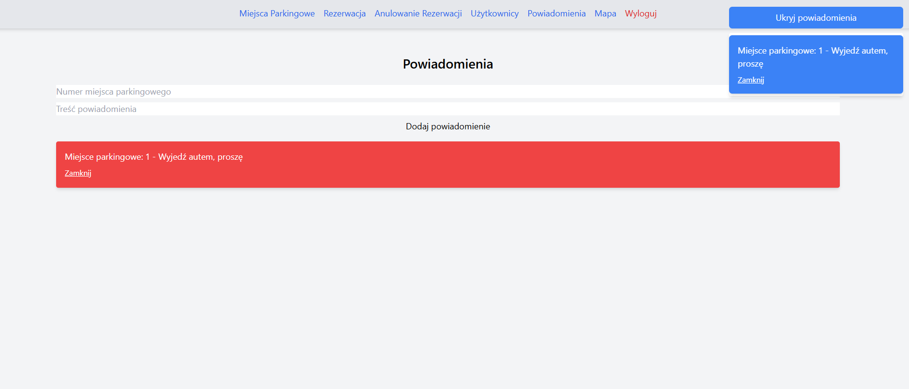

# Parking Management System
> A web-based parking management system that allows users to reserve parking spaces, manage users, and send notifications.  
> Live demo [_coming soon_].

## Table of Contents
* [General Info](#general-information)
* [Technologies Used](#technologies-used)
* [Features](#features)
* [Screenshots](#screenshots)
* [Setup](#setup)
* [Usage](#usage)
* [Project Status](#project-status)
* [Room for Improvement](#room-for-improvement)
* [Acknowledgements](#acknowledgements)
* [Contact](#contact)

## General Information
The **Parking Management System** streamlines parking space management for administrators and end-users. Users can:
- View available parking spaces,
- Reserve a spot,
- Manage reservations and send notifications (e.g., "You are blocking my car").

### Purpose:
The goal was to create an intuitive, modern system for efficient parking space allocation while providing tools for communication between users and administrators.

---

## Technologies Used
- **Frontend**:
  - React.js
  - Tailwind CSS
  - Bulma
  - Axios
- **Backend**:
  - Node.js with Express.js
  - MongoDB (Mongoose for ODM)
- **Authentication**:
  - JSON Web Tokens (JWT)
- **Tools**:
  - Visual Studio Code
  - Postman for API testing

---

## Features
- 🚗 **View Available Parking Spaces**: Users can see real-time data of free and occupied spaces.
- ✅ **Reserve Parking Spaces**: Authenticated users can reserve a spot.
- 🔄 **Change Space Status**: Admins can change space status (occupied ↔ free).
- 👥 **User Management**: Admins can view all users and their reserved spaces.
- 📩 **Notifications**: Users can send notifications (e.g., "Your car is blocking mine").
- 🔒 **Secure Authentication**: JWT-based authentication system for secure access.
- 🛠️ **Dynamic Notifications Bar**: Users see live notifications in the app header.

---

## Screenshots

### Dashboard


### Notifications


### User Management


---

## Setup

### Requirements:
- Node.js v16+
- MongoDB installed locally or remote instance (Mongo Atlas)
- Browser (Chrome/Edge/Firefox)

### Installation Steps:
1. Clone the repository:
   ```bash
   git clone https://github.com/your-username/parking-management-system.git
   cd parking-management-system

2. Install dependencies for backend:
  ```bash
cd backend
npm install
  ```
3.Install dependencies for frontend:

  ```bash
Skopiuj kod
cd frontend
npm install
  ```
4.Run backend:

```bash
cd backend
npm start
# Backend runs on: http://localhost:5001
```
5.Run frontend:
```bash
cd frontend
npm start
# Frontend runs on: http://localhost:3000
```
6. Connect MongoDB:

Add MongoDB URI to backend/.env:
```env
MONGO_URI=your_mongodb_connection_string
JWT_SECRET=your_secret_key
```
## Usage
### Fetch Parking Spaces:
```javascript

import { fetchParkingSpaces } from './api/parkingApi';

useEffect(() => {
  fetchParkingSpaces().then((spaces) => {
    console.log('Available Spaces:', spaces);
  });
}, []);

```

### Reserve a Parking Space:

```javascript

import { reserveParkingSpace } from './api/parkingApi';

reserveParkingSpace('space_id_123')
  .then((res) => console.log(res.message))
  .catch((err) => console.error(err));


```

### Notifications:
Users can send notifications using the Notifications Form on the dashboard.
Notifications appear dynamically on the header bar.
## Project Status
Project is: in progress
The main functionalities (reservations, user management, notifications) are working. Future improvements and testing are ongoing.

## Room for Improvement
### Areas to improve:

Add real-time updates with WebSockets for live notifications.
Implement role-based access for administrators and users.
Improve UX/UI design using more animations and transitions.
### To-do:

Add the ability to cancel reservations.
Allow users to view their notification history.
Integration with Google Maps for navigation to parking spots.
## Acknowledgements
This project was inspired by the need for modern, dynamic parking management systems. Special thanks to:

React.js and Node.js communities for the resources and support.
Tailwind CSS and Bulma for providing clean and responsive UI libraries.
## Contact
Created by @Konume - feel free to reach out with suggestions or feedback!


